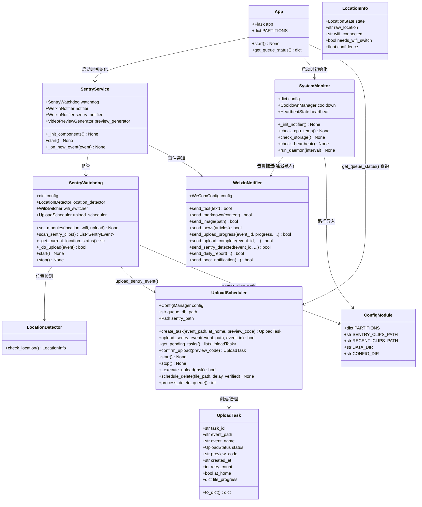
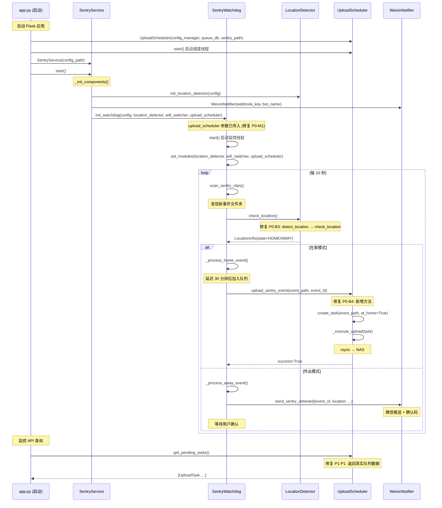
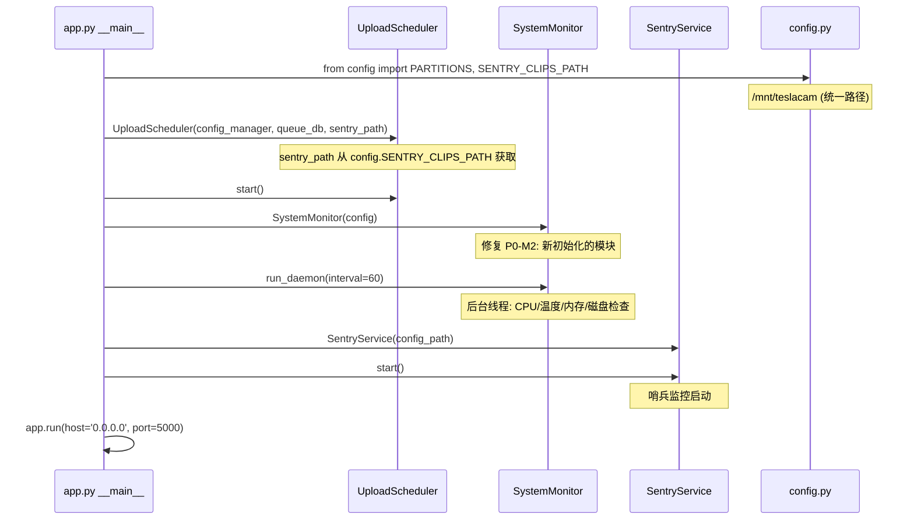
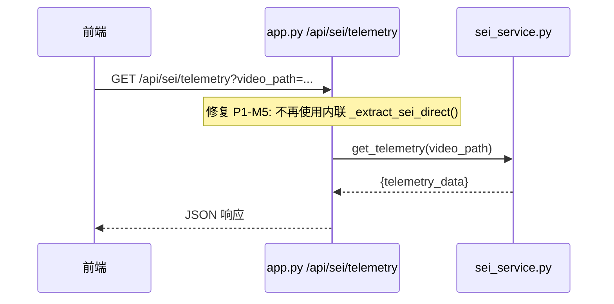
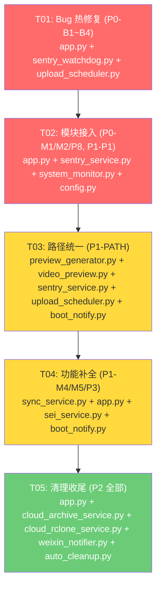

# TeslaUSB A7Z 深度重构 — 系统设计与任务分解

> **项目**: teslausb_a7z_refactor  
> **语言**: Python (Flask)  
> **项目根**: `D:\teslausb\a7z\`  
> **设计者**: Bob (Architect)  
> **排除**: hardware_watchdog.py（方案 C）

---

## Part A: 系统设计

### 1. 实现方案 (Implementation Approach)

#### 1.1 核心挑战

| 挑战 | 严重度 | 说明 |
|------|--------|------|
| **运行时崩溃** | 🔴 P0 | 3 类致命 Bug：`logger` 未定义 / `redirect` 未导入 / 方法名错误，导致多个路由和后台服务 500/崩溃 |
| **孤立模块接入** | 🔴 P0 | `upload_scheduler` / `system_monitor` 完全未被活跃代码引用，现有 fallback (`shutil.copy2`) 无断点续传 |
| **路径碎片化** | 🟡 P1 | 7 个文件硬编码旧路径 `/media/cnlvan/cam`，与 `config.py` 统一路径 `/mnt/teslacam` 不一致 |
| **功能断裂** | 🟡 P1 | 队列状态返回空、SSID 门控缺失、sei_service 重复实现 |
| **死代码** | 🟢 P2 | 未使用的导入、重复路由、未调用的方法 |

#### 1.2 框架选型与架构

**保持现有技术栈**，不引入新框架：

| 组件 | 选型 | 理由 |
|------|------|------|
| Web 框架 | Flask（已有） | 无需更换，修复即可 |
| 上传调度 | SQLite + rsync（已有） | 轻量、支持断点续传 |
| 路径管理 | `config.py` PARTITIONS 常量 | 已定义正确路径，只需统一引用 |
| 监控告警 | `system_monitor.py` | 现有实现完整，只需接入 |
| 微信通知 | 企业微信 Webhook（已有） | 现有 `WeixinNotifier` 双机器人架构 |

**架构模式**: 保持现有分层 — Flask 路由层 → 服务层 → 底层工具层。所有模块通过 `config.py` 获取全局常量，通过延迟导入避免循环依赖。

#### 1.3 关键设计决策

1. **P0-B4 修复策略**: 在 `UploadScheduler` 中新增 `upload_sentry_event()` 方法，内部调用 `create_task()` + 标记为在家自动确认模式。**不在** `sentry_watchdog._do_upload()` 中绕过调度器。

2. **sei_service 决策**: **保留 `sei_service.py` 模块**（527 行，更规范），删除 `app.py` 内联 `_extract_sei_direct()` / `_parse_sei_nal()`，让路由直调 `sei_service.get_telemetry()`。

3. **鉴权装饰器**: 当前 `AUTH_ENABLED = False`，`require_auth` 实际上不执行鉴权逻辑。修复缺失的 `session`/`url_for` 导入，但保持鉴权关闭状态。

4. **旧路由迁移**: 旧版 `/boombox`/`/lightshow`/`/wraps` HTML 路由 → 301 重定向到 `/api/media/*` 新版路由，不直接删除。

---

### 2. 文件列表 (File List)

以下列出所有**将被修改或新建**的文件。路径相对于项目根 `D:\teslausb\a7z\`。

```
# ═══ 核心修复（P0） ═══
app.py                               # 主 Flask 应用 (约 4908 行)
sentry_watchdog.py                   # 哨兵监控守护进程
upload_scheduler.py                  # 上传调度器（新增方法）
sentry_service.py                    # 哨兵服务主程序
system_monitor.py                    # 系统监控告警模块
location_detector.py                 # 位置检测模块（确认方法签名）

# ═══ 路径统一（P1） ═══
config.py                            # 全局配置常量（已有正确路径，需确认导出完整性）
video_preview.py                     # 视频预览生成（行 802 硬编码）
preview_generator.py                 # 预览图生成器（行 40 硬编码）
boot_notify.py                       # 开机通知（行 43-45 硬编码分区）

# ═══ SSID 门控 + sei 决策（P1） ═══
sync_service.py                      # 视频同步服务（check_prerequisites 缺少 SSID 检查）
sei_service.py                       # SEI 遥测模块（保留模块版本，供 app.py 调用）

# ═══ 模块接入增强（P2） ═══
weixin_notifier.py                   # 微信通知器（5 个未调用方法接入）
auto_cleanup.py                      # 自动清理模块（reload_global_settings 钩子）
cloud_archive_service.py             # 云归档服务（死导入清理）
cloud_rclone_service.py              # rclone 服务封装（upload_file 调用确认）

# ═══ 新增文件 ═══
boot-notify.service.j2              # systemd oneshot 服务模板（如设备上不存在）
docs/system_design.md               # 本文档（落盘）
docs/class-diagram.mermaid          # 类图提取
docs/sequence-diagram.mermaid       # 时序图提取
```

---

### 3. 数据结构和接口 (Data Structures & Interfaces)

#### 3.1 类图 — 现有架构关系



#### 3.2 关键接口变更

| 接口 | 位置 | 变更类型 | 说明 |
|------|------|---------|------|
| `UploadScheduler.upload_sentry_event(event_path, event_id)` | `upload_scheduler.py` | **新增** | 封装 `create_task()` + `at_home=True` 模式，供 SentryWatchdog 调用 |
| `SentryWatchdog._do_upload()` | `sentry_watchdog.py` | **修改** | 移除 `shutil.copy2` fallback，仅走 `upload_scheduler.upload_sentry_event()` |
| `SentryWatchdog._get_current_location_status()` | `sentry_watchdog.py:319` | **修改** | `detect_location()` → `check_location()`，适配 LocationDetector 真实接口 |
| `SentryService._init_components()` | `sentry_service.py:207-211` | **修改** | `init_watchdog()` 调用增加 `upload_scheduler` 参数 |
| `app.get_queue_status()` | `app.py:465-472` | **修改** | 从返回空 dict → 调用 `upload_scheduler.get_pending_tasks()` |
| `app.__main__` | `app.py:4908` | **修改** | 增加 `SystemMonitor` 初始化和 `UploadScheduler` 实例化 |
| `sync_service.check_prerequisites()` | `sync_service.py:186-217` | **修改** | 增加 SSID 门控检查（`_get_current_ssid()` vs `home_ssid` 配置） |
| `sei_service.get_telemetry()` | `sei_service.py` | **调用方变更** | `app.py` 内联函数替换为模块调用 |

---

### 4. 程序调用流程 (Program Call Flow)

#### 4.1 哨兵事件检测 → 上传（修复后）



#### 4.2 系统启动初始化（修复后）



#### 4.3 SEI 遥测请求（修复后）



---

### 5. 待明确事项 (Anything UNCLEAR)

| # | 问题 | 影响 | 建议 |
|---|------|------|------|
| Q1 | **boot_notify systemd 服务状态**：设备上 `boot-notify.service` 是否存在？是否 enabled？ | P1-M4 阻塞 | 需 SSH 到 A7Z 执行 `systemctl status boot-notify.service`。如不存在，需创建 `/etc/systemd/system/boot-notify.service` |
| Q2 | **sei_service 功能完整性**：`sei_service.py` 的 `get_telemetry()` 是否与内联 `_extract_sei_direct()` 功能完全等价？ | P1-M5 决策 | 建议先在 A7Z 上用同一测试视频对比两次结果，确认模块版本无功能退化后再删除内联 |
| Q3 | **旧路由外部依赖**：旧版 `/boombox`/`/lightshow`/`/wraps` HTML 路由是否有浏览器书签或外部脚本依赖？ | P2-CLEAN 策略 | 如有依赖，保留 301 重定向至少一个版本周期；如无，可直接删除 |
| Q4 | **weixin_notifier P2 方法优先级**：`send_upload_progress` 和 `send_daily_report` 用户感知强，是否提级到 P1？ | P2-P4 范围 | 建议保持 P2，先确保基础稳定性；后续版本可提级 |
| Q5 | **验证策略**：是否需要在 Radxa A7Z 实机上做回归测试？ | 整个重构 | 强烈建议，至少验证：哨兵扫描→上传→队列状态→监控告警 四条链路 |
| Q6 | **config.py 与 RD-T 版本差异**：根目录 `config.py` (PARTITIONS=`/mnt/teslacam`) 与 `RD-T/teslausb/config.py` (PARTITIONS=`/media/cnlvan/cam`) 不一致 | 路径统一依据 | 以根目录 `config.py` 为准（A7Z 实际部署路径），所有模块统一从此文件导入 |

---

## Part B: 任务分解

### 6. 依赖包列表 (Required Packages)

本次重构不引入新的第三方依赖。所有修复在现有依赖范围内：

```
- flask >= 2.0: Web 框架（已有）
- requests >= 2.25: HTTP 请求（已有）
- werkzeug: Flask 工具包（已有）
- sqlite3: 内置，上传队列数据库
- subprocess: 内置，rsync/rclone 调用
- logging: 内置，日志输出
```

---

### 7. 任务列表 (Task List)

> **硬约束**: 最多 5 个任务。按功能模块分组，每个任务至少 3 个相关文件。P0 优先级最高。

#### T01: Bug 热修复 — 消除 4 个致命运行时崩溃 (P0-B1~B4)

**优先级**: P0  
**说明**: 修复导致 500/崩溃的 4 个致命 Bug，涉及 `app.py`、`sentry_watchdog.py`、`upload_scheduler.py`。

**源文件**:
- `app.py` — 第12行：Flask 导入列表增加 `redirect`、`url_for`、`session`；第1560-1562行：`logger.info`/`logger.warning` → `app.logger.info`/`app.logger.warning`
- `sentry_watchdog.py` — 第325行：`detect_location()` → `check_location()`；第551行：调用 `upload_sentry_event()` → 使用 `create_task()` 语义
- `upload_scheduler.py` — 新增 `upload_sentry_event(event_path, event_id) -> bool` 方法，封装 `create_task()` + `at_home=True` + 触发上传

**依赖**: 无（首要任务）

---

#### T02: 模块接入 — upload_scheduler + system_monitor 入主流程 (P0-M1, P0-M2, P0-P8, P1-P1)

**优先级**: P0  
**说明**: 将两个孤立模块接入 Flask 启动流程，修复队列状态 API，修复鉴权装饰器。

**源文件**:
- `app.py` — 第7-16行：确保 `logging` 导入；第465-472行：`get_queue_status()` 改为调用 `upload_scheduler.get_pending_tasks()`；第4903-4908行：`__main__` 中增加 `SystemMonitor` 初始化 + `UploadScheduler` 实例化 + `start()` 调用；第1021-1034行：`require_auth` 装饰器确认 `load_config`/`session`/`url_for` 可用（已在 T01 修复导入）
- `sentry_service.py` — 第207-211行：`init_watchdog()` 调用增加 `upload_scheduler=self.upload_scheduler` 参数传递
- `system_monitor.py` — 第577-578行：硬编码 `/media/cnlvan/cam` → `config.PARTITIONS["cam"]`；确认 `SystemMonitor.__init__` 接受 `config` 参数
- `config.py` — 确认导出 `PARTITIONS`、`SENTRY_CLIPS_PATH`、`DATA_DIR` 等常量

**依赖**: T01（需先修复 P0-B1/B2 `redirect`/`logger` 导入）

---

#### T03: 路径统一 — 7 文件消除硬编码旧路径 (P1-PATH)

**优先级**: P1  
**说明**: 将所有硬编码的 `/media/cnlvan/cam` 替换为从 `config.py` 导入的路径常量。

**源文件**:
- `preview_generator.py` — 第40行：`BASE_CAM_PATH = Path('/media/cnlvan/cam/TeslaCam')` → `BASE_CAM_PATH = Path(config.SENTRY_CLIPS_PATH).parent.parent`
- `video_preview.py` — 第802行：`Path('/media/cnlvan/cam/TeslaCam')` → `Path(config.PARTITIONS["cam"]) / "TeslaCam"`
- `sentry_service.py` — 第59行 DEFAULT_CONFIG 中的 `sentry_clips_path` fallback；第117行 fallback `/media/cnlvan/cam`
- `sentry_watchdog.py` — 第148行 DEFAULT_CONFIG 中的 `sentry_clips_path`（注释/文档性质，不改运行时逻辑，但统一引用）
- `upload_scheduler.py` — 第34行：`DEFAULT_SENTRY_PATH = "/media/cnlvan/cam/TeslaCam/SentryClips"` → `config.SENTRY_CLIPS_PATH`
- `system_monitor.py` — 第577-578行：已在 T02 修复
- `boot_notify.py` — 第43-45行：`PARTITIONS` dict 中的 `/media/cnlvan/cam` → 从 `config.PARTITIONS` 导入

**依赖**: T02（config.py 路径常量已在 T02 中确认完整）

---

#### T04: 功能补全 — SSID 门控 + sei_service 决策 + sync 增强 (P1-M4, P1-M5, P1-P3)

**优先级**: P1  
**说明**: 修复 SSE 同步门控，统一 SEI 实现，确认开机通知。

**源文件**:
- `sync_service.py` — 第146行 `_get_current_ssid()` 已存在；第186-217行 `check_prerequisites()` 中增加 SSID 门控：当 `cfg["home_ssid"]` 非空时，要求当前 SSID 匹配才允许同步
- `app.py` — SEI 相关路由：删除内联 `_extract_sei_direct()` / `_parse_sei_nal()` 函数，改为调用 `sei_service.get_telemetry()`
- `sei_service.py` — 确认 `get_telemetry()` 函数签名与 `_extract_sei_direct()` 等价，必要时微调
- `boot_notify.py` — 确认 systemd oneshot 服务文件存在；如不存在，编写 `boot-notify.service.j2` 模板

**依赖**: T02（app.py 已在 T02 完成基础修复），T03（路径统一）

---

#### T05: 清理收尾 — 死代码清理 + 路由统一 + 云归档修复 + 微信通知接入 (P2 全部)

**优先级**: P2  
**说明**: 清理死导入/死代码，统一旧路由为 301 重定向，修复云归档 `upload_file` 调用链，接入微信通知器未使用方法。

**源文件**:
- `app.py` — 死导入清理：`Path`(第11行，仅用于 `load_config` 可保留或内联)、未实际使用的 `BoomboxService`/`LightshowService`/`WrapsService`/`MediaService`（第28行）；旧路由 `/boombox`/`/lightshow`/`/wraps` HTML 页面 → 301 重定向到 `/api/media/*`
- `cloud_archive_service.py` — 第36-43行：死导入 `get_stored_token`/`refresh_token`/`upload_file` 清理；确认 `upload_file()` 调用链路完整
- `cloud_rclone_service.py` — 第502行 `upload_file()` 被正确调用（与 `cloud_archive_service.py` 协作确认）
- `weixin_notifier.py` — `send_markdown`/`send_image`/`send_news`/`send_upload_progress`/`send_daily_report` 在合适的调用点接入：`send_upload_progress` 在 `UploadScheduler._execute_upload()` 进度回调中调用；`send_daily_report` 在 `SystemMonitor.check_heartbeat()` 中调用
- `auto_cleanup.py` — 第249行 `reload_global_settings()` 热重载钩子：在 `ConfigManager.reload_if_changed()` 中触发；第256行 `detect_folders()` 未被调用则删除；第53行 `MIN_FREE_TARGET_MB` 保留（实际被第312行引用）

**依赖**: T04（sei_service 已确定保留模块版本；sync/gating 已修复）

---

### 8. 共享知识 (Shared Knowledge)

```
═══════════════════════════════════════════════════════════
跨文件约定 - TeslaUSB A7Z 重构
═══════════════════════════════════════════════════════════

[路径] 所有模块通过 config.py 获取路径常量，禁止硬编码:
  from config import PARTITIONS, SENTRY_CLIPS_PATH, DATA_DIR, CONFIG_DIR

[日志] 所有模块使用 logging.getLogger(__name__)，不在模块顶层配置 logging.basicConfig:
  import logging
  logger = logging.getLogger(__name__)

[Flask] app.py 中日志使用 app.logger，非裸 logger:
  app.logger.info("...")

[上传] 哨兵事件上传统一走 UploadScheduler.create_task() / upload_sentry_event():
  禁止直接 shutil.copy2 绕过调度器

[延迟导入] 避免循环依赖的模块使用函数内延迟导入:
  def _init_notifier(self):
      from weixin_notifier import WeixinNotifier

[鉴权] AUTH_ENABLED = False (config.py)，require_auth 装饰器在所有路由上
  但实际不执行鉴权逻辑（保持现状）

[配置] 全局配置常量在 config.py 中定义:
  - PARTITIONS: 分区挂载点 {"cam": "/mnt/teslacam", ...}
  - SENTRY_CLIPS_PATH: "{PARTITIONS['cam']}/TeslaCam/SentryClips"

[数据库] upload_scheduler 使用 SQLite (WAL 模式):
  - 默认路径: /data/sentry_queue.db
  - 表: upload_tasks, delete_queue, completed_events

[API 响应] 所有 /api/* 路由返回 JSON:
  {"success": bool, "data": ..., "error": str}

[微信通知] 双机器人架构:
  - 状态机器人(notifier): 上传进度/完成/失败/系统告警
  - 哨兵机器人(sentry_notifier): 哨兵事件检测/确认请求
```

---

### 9. 任务依赖图 (Task Dependency Graph)



**说明**: 任务间形成流水线依赖：
- T01（Bug 修复）→ T02（模块接入，依赖正确的 import 和方法）→ T03（路径统一，依赖 config.py 就绪）→ T04（功能补全，依赖路径就绪）→ T05（清理收尾，在所有功能稳定后执行）

---

## 附录: 文件-问题映射速查表

| 问题 ID | 涉及文件 | 关键行号 | 修复任务 |
|---------|---------|---------|---------|
| P0-B1 | `app.py` | 1560, 1562 | T01 |
| P0-B2 | `app.py` | 12 (导入), 1034, 1123, 1125 等 | T01 |
| P0-B3 | `sentry_watchdog.py` | 325 | T01 |
| P0-B4 | `sentry_watchdog.py` + `upload_scheduler.py` | 551; 新增方法 | T01 |
| P0-M1 | `app.py` + `sentry_service.py` | 465-472; 207-211 | T02 |
| P0-M2 | `app.py` + `system_monitor.py` | 4903-4908; 577-578 | T02 |
| P0-P8 | `app.py` | 1021-1034, 12 | T01→T02 |
| P1-M4 | `boot_notify.py` | 全文 + systemd 服务 | T04 |
| P1-M5 | `app.py` + `sei_service.py` | app.py 内联函数; sei_service.py 全文 | T04 |
| P1-P1 | `app.py` + `upload_scheduler.py` | 465-472; 400-412 | T02 |
| P1-P3 | `sync_service.py` | 146, 186-217 | T04 |
| P1-PATH | 7 个文件 | 见上表 | T03 |
| P2-P2 | `cloud_rclone_service.py` + `cloud_archive_service.py` | 502; 36-43 | T05 |
| P2-P4 | `weixin_notifier.py` | 296, 318, 409, 519, 701 | T05 |
| P2-P5 | `auto_cleanup.py` | 249 | T05 |
| P2-P6 | `auto_cleanup.py` | 256 | T05 |
| P2-P7 | `auto_cleanup.py` | 53, 312 | T05 |
| P2-CLEAN | `app.py` + `cloud_archive_service.py` | 11, 28; 36-43 | T05 |
